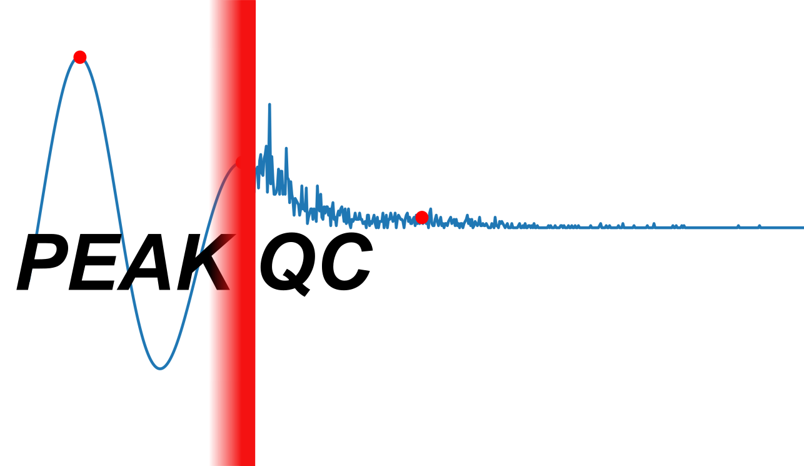

Periodicity Evaluation in scATAC-seq data for quality assessment

A python tool for ATAC-seq quality control in single cells. 
On the bulk level quality control approaches rely on four key aspects: 

    - signal-to-noise ratio 
    - library complexity
    - mitochondrial DNA nuclear DNA ratio 
    - fragment length distribution 

Hereby relies PEAKQC on the evaluation of the fragment length distribution.
While on the bulk level the evaluation is done visually, it is not possible to do that on the single cell level.
PEAKQC solves this constraint with an convolution based algorithmic approach.

# API Documentation
A detailed API documentation is provided by our read the docs page:
https://loosolab.pages.gwdg.de/software/peakqc/

# Workflow

To execute the tool an anndata object and fragments, corresponding to the cells in the anndata have to be provided. The fragments can be either determined from a bamfile directly or by an fragments file in the bed format. If a fragments bedfile is available this is recommended to shorten the runtime.


# Installation

## PyPi
```
pip install peakqc
```
## From Source

### 1. Enviroment & Package Installation
1. Download the repository. This will download the repository to the current directory
```
git@gitlab.gwdg.de:loosolab/software/peakqc.git
```
2. Change the working directory to the newly created repository directory.
```
cd sc_framework
```
3. Install analysis environment. Note: using `mamba` is faster than `conda`, but this requires mamba to be installed.
```
mamba env create -f peakqc_env.yml
```
4. Activate the environment.
```
conda activate peakqc
```
5. Install PEAKQC into the enviroment.
```
pip install .
```

### 2. Package Installation
1. Download the repository. This will download the repository to the current directory
```
git@gitlab.gwdg.de:loosolab/software/peakqc.git
```
2. Change the working directory to the newly created repository directory.
```
cd sc_framework
```
3. Install PEAKQC into the enviroment.
```
pip install .
```

# Quickstart

Below is a minimal example showing how to integrate FLD scoring into a Jupyter Notebook. A fully worked example is available at [`paper/example_notebook.ipynb`](paper/example_notebook.ipynb).

1. **Load your AnnData object**  
   ```python
   import scanpy as sc

   # replace with your path to the .h5ad file
   anndata = sc.read_h5ad('path/to/your_data.h5ad')
```

Note: We recommend storing your cell barcodes as the `.obs` index in `adata`. If your barcodes are instead in a specific `.obs` column, you can override this via the `barcode_col` parameter (see below).

2. **Import FLD scoring function**

```python
from peakqc.fld_scoring import add_fld_metrics
```
3. **Prepare fragment files**

    - Provide either a BED or BAM file via fragments=.

    - BED files are recommended for faster runtime.

    - Example:
```python
fragments = 'path/to/fragments.bed'      # or .bam
```

4. **Run FLD scoring**
```python
adata = add_fld_metrics(adata=anndata,
                        fragments=fragments,
                        barcode_col=None,
                        plot=True,
                        save_density=None,
                        save_overview=None,
                        sample=0,
                        n_threads=8,
                        sample_size=5000,
                        mc_seed=42,
                        mc_samples=1000
                        )
```

5. **Filter on PEAKQC scores**
    In our experience, PEAKQC scores above 100 are generally effective for filtering out low-quality cells. Hereby PEAKQC scores positively correlate with improving FLD patterns. However, it is important to note that optimal thresholds can vary between datasets and should be tuned to achieve reliable results.

    Threshold selection may also depend on the specific requirements of your downstream analysis, and should be adjusted accordingly.

For a step-by-step walkthrough along with plotting examples, see the example notebook at
`paper/example_notebook.ipynb`


